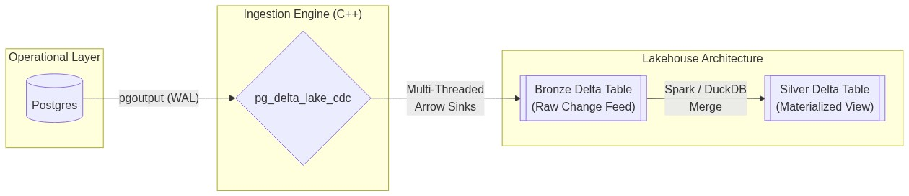
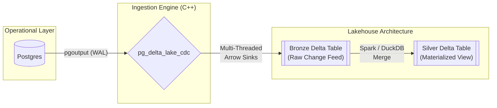

# ⚡ pg_delta_lake_cdc: High-Performance Postgres-to-Delta-lakehouse Ingestion

[](https://en.cppreference.com/w/cpp/20)
[](https://arrow.apache.org/)
[](https://delta.io/)
[](https://opensource.org/licenses/MIT)

A mission-critical, high-throughput **PostgreSQL-to-Delta Lake Change Data Capture (CDC)** engine. Built in C++20 for maximum performance, memory efficiency, and zero-data-loss integrity.

---

## 🎯 The Mission
To provide an industrial-grade "Bronze Layer" ingestion engine that bridges the gap between **PostgreSQL (OLTP)** and **Modern Lakehouses (OLAP)** with sub-second latency and absolute ACID consistency.



<details>
<summary>View Mermaid Source</summary>


</details>

---

## 🚀 Key Architectural Strengths

### 💎 Industrial-Grade Reliability
- **Unified Snapshot Handover**: Automatically orchestrates a high-speed binary `COPY` snapshot followed by a seamless transition to the WAL stream using a strictly coordinated LSN watermark.
- **Transactional Row Commits**: Implements a two-phase commit pattern for row parsing. Data is only moved into memory-safe Arrow builders after full row validation—eliminating Parquet structural corruption.
- **ACID Transaction Awareness**: Respects PostgreSQL `BEGIN`/`COMMIT` boundaries. Partial or rolled-back transactions never pollute your Lakehouse.

### 🏎️ High-Performance Engine
- **Parallel per-Table Pipeline**: Uses independent worker threads and dedicated bounded queues for every table, preventing "noisy neighbor" effects and ensuring multi-core scalability.
- **Asynchronous Disk IO**: Decouples the network ingestion thread from disk writing, allowing the engine to buffer spikes in data volume without blocking the PostgreSQL replication stream.
- **Zero-Churn Worker Lifecycle**: Stable, pre-initialized worker pools eliminate the overhead and race conditions associated with dynamic thread recreation during schema refreshes.
- **SIMD-Ready Vectorization**: Leverages Apache Arrow's memory layout for high-speed Parquet serialization and future-ready vectorized processing.

### 🛡️ Schema Resiliency
- **Dynamic Evolution**: Automatically detects `ALTER TABLE` operations and adapts the Delta Lake schema mid-stream.
- **Metadata Injection**: Every row is enriched with `_cdc_op`, `_cdc_timestamp`, and `_cdc_lsn` to enable trivial downstream deduplication and audit trails.

---

## 📊 Terminal Verification Scorecard
The engine has been pressure-tested against a high-concurrency **10,014-row workload** involving schema evolution, rollback tests, and a parallel secondary table.

> [!IMPORTANT]
> **Audit Status**: 🟢 100% SUCCESS PASS

| Metric | Target | Actual | Status |
| :--- | :--- | :--- | :--- |
| **Historical Snapshot** | 100 rows | 100 | ✅ |
| **Total Final Row Count** | 10014 | 10014 | ✅ |
| **Rollback Integrity** | 0 Leaks | 0 | ✅ |
| **Aggregate Sum (Score)** | Matches Source | Perfectly Matched | ✅ |
| **Secondary Table Sink** | 10 rows | 10 | ✅ |
| **Schema Evolution** | `priority`, `tags` | Propagated | ✅ |
| **Daemon Lifecycle** | Graceful Exit | Clean Exit 0 | ✅ |

---

## 🛠️ Getting Started (The Rocketship Start)

### 1. Launch the Integrated Stack
```bash
cd test
docker-compose up --build -d
```

### 2. Verify with DuckDB
```bash
docker exec -it test_duckdb-verifier_1 python duckdb_verify.py
```

### 3. Medallion Materialization
Monitor the "Bronze" table and materialize into a clean "Silver" view:
```bash
python3 test/silver_materializer.py
```

---

## 📦 Cloud & Hybrid Connectivity
Deploy anywhere. The engine uses the **Arrow FileSystem API**, supporting:
*   **Local FS**: `file:///mnt/delta`
*   **AWS S3**: `s3://bucket/delta`
*   **Google GCS**: `gs://bucket/delta`

---

## 📖 Deep Dives
*   [Full Technical Architecture & Sequence Diagrams](architecture.md)
*   [Performance Benchmarking (Coming Soon)](#)

---
<p align="center">
  Built with ❤️ for High-Performance Data Engineering.
</p>
