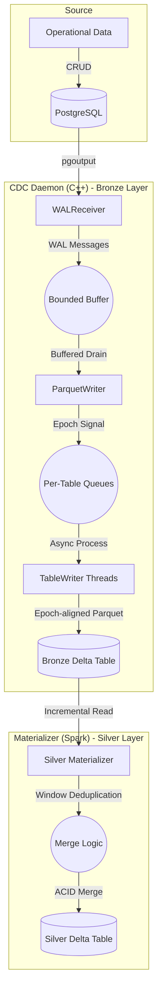
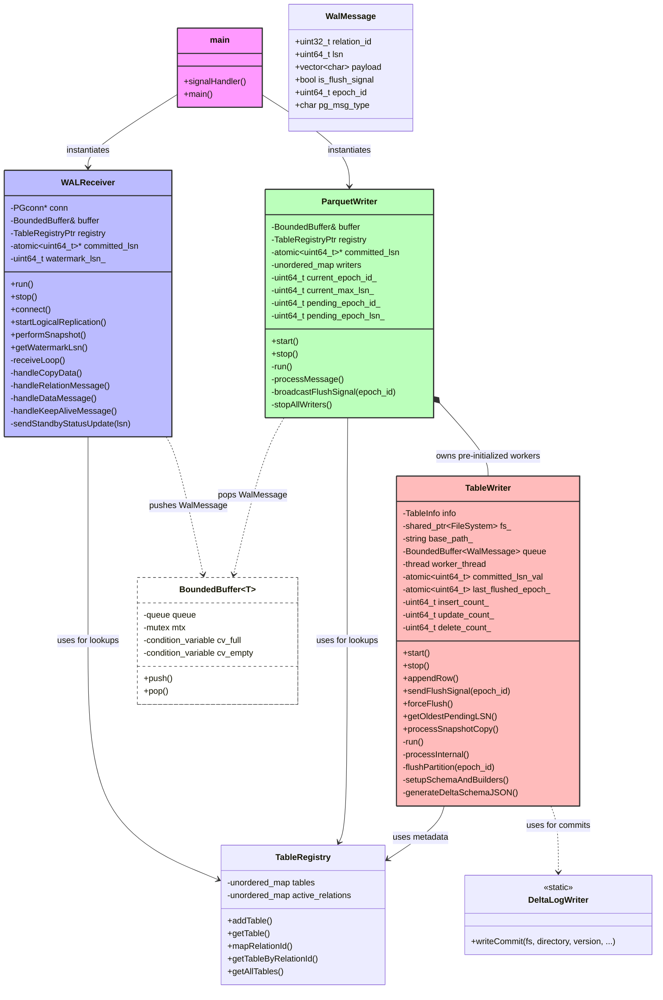
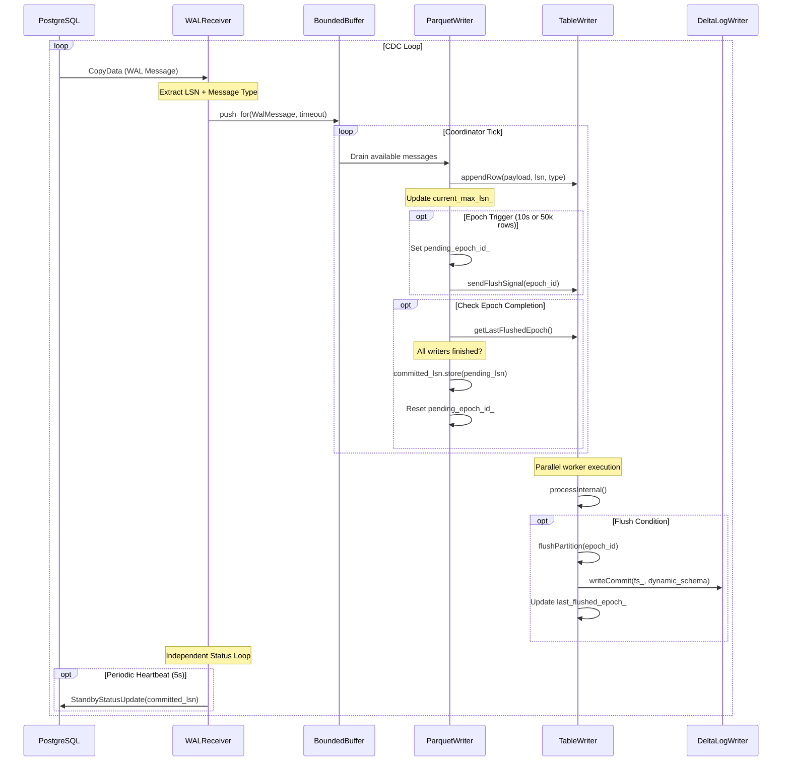
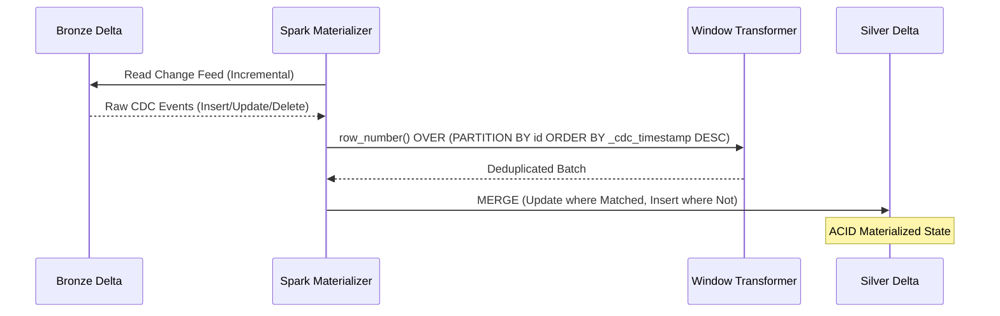

# Architecture & Design: pg_delta_lake_cdc

This document describes the high-level architecture, threading model, and the **Medallion Architecture** data flow of the PostgreSQL CDC pipeline.

> [!TIP]
> **Mermaid Support in IDE**:
> 1. **Native Rendering**: Install the **"Markdown Preview Mermaid Support"** extension (ID: `bierner.markdown-mermaid`).
> 2. **Pre-rendered Images**: The diagrams are pre-rendered in the `images/` directory. To update them after modifying the source, run:
>    ```bash
>    python3 scripts/render_diagrams.py
>    ```

## End-to-End Data Flow (Medallion Architecture)

The pipeline captures real-time changes from a source operational database and materializes them into a refined "Silver" Delta table for analytical use.


<details>
<summary>View Mermaid Source</summary>


</details>

| Layer | Type | Responsibility |
| :--- | :--- | :--- |
| **Bronze** | Raw Log | Append-only history of every change. Preserves full audit trail. |
| **Silver** | Materialized | Latest state per record. Deduplicated and ready for BI/Analytics. |

## Component Overview

The system is designed as a producer-consumer architecture using a thread-safe bounded buffer for decoupled processing.

### Class Hierarchy & Organization


<details>
<summary>View Mermaid Source</summary>


</details>

## Detailed Data Flow (Sequence Diagram)

### I. WAL Capture & Bronze Writing (C++ Daemon)

This diagram illustrates the lifecycle of a WAL event from PostgreSQL to a raw Delta log.


<details>
<summary>View Mermaid Source</summary>


</details>

### II. Silver Materialization (Spark Incremental Merge)

Illustrates how the downstream Spark process reconciles the raw Bronze log into a deduplicated Silver state.


<details>
<summary>View Mermaid Source</summary>


</details>

## Component Details

### 1. WALReceiver
The `WALReceiver` is a networking component responsible for the high-performance ingestion of PostgreSQL change events.
- **Design**: Implemented using `libpq` for the PostgreSQL wire protocol. Uses a non-blocking IO loop (`PQconsumeInput` + `PQgetCopyData`).
- **Heartbeat Safety**: Implements a dedicated status update mechanism that continues to send heartbeats to PostgreSQL even if the dispatcher pipeline is temporarily blocked (backpressure), preventing slot timeout.
- **LSN Extraction**: Every WAL message ('w') contains a 64-bit Log Sequence Number (LSN). The receiver parses this and associates it with the data payload.

### 2. BoundedBuffer
The `BoundedBuffer` is the primary decoupling mechanism between the producer (network) and consumer (disk) threads.
- **Design**: A template-based thread-safe circular buffer. It uses `std::mutex` and `std::condition_variable` to coordinate access.
- **Backpressure**: When the buffer reaches its maximum capacity (default 10,000 messages), the `push()` call will block. This prevents the daemon from consuming all system memory if the disk writing or S3 upload becomes a bottleneck.

#### 3. TableWriter: The Parallel Execution Engine
The `TableWriter` is the heart of the engine's data processing pipeline. It is a fully asynchronous worker that manages processing for a specific table in a dedicated thread.

> [!NOTE]
> **Performance Tip**: By decoupling tables into their own threads, we prevent a single outlier (e.g., a high-volume `logs` table) from backpressuring the ingestion of critical operational data like `orders` or `users`.

- **Stable Worker Lifecycle**: Workers are **pre-initialized** at daemon startup. This architectural shift from dynamic creation eliminates the "Signal Race Conditions" and thread creation overhead that often plague naive CDC implementations during schema refreshes.
- **Asynchronous Queueing**: Every table worker maintains its own `BoundedBuffer` queue. The coordinator pushes messages to these queues, allowing the main ingestion stream to continue uninterrupted even if a specific table's disk IO is slow.
- **Unified Handover Guard**: Uses a strict **LSN Boundary Guard** (`msg.lsn < watermark_lsn`). During the transition from historical binary `COPY` snapshot to real-time stream, the engine perfectly suppresses duplicates while ensuring that even "Edge-Case" deletions happening *exactly* at the slot creation boundary are captured.
- **Transactional Row Commits (Two-Phase Parsing)**: 
    - **Phase 1 (Validation)**: Every PostgreSQL message is parsed into a temporary local buffer.
    - **Phase 2 (Memory Commit)**: Only if the entire row (including metadata and variable-length columns) is valid, it is committed to the Arrow/Parquet builders. 
    - **Impact**: This definitively solves the "Parquet Column Mismatch" corruption that occurs when partial failure leaves builders in an inconsistent state.
- **Dynamic Delta Schema Generation**: On every partition flush, the engine generates a consistent `_delta_log` JSON entry, ensuring the Delta table remains ACID-compliant and queryable by standard lakehouse tools (Spark, Presto, DuckDB).

### 4. ParquetWriter (Coordinator & Epoch Manager)
The `ParquetWriter` acts as the central coordinator for the parallel pipeline.
- **Global Epoch Coordination**: Implements cross-table consistency by triggering and monitoring global "epochs". An epoch is triggered every 10 seconds or every 50,000 processed rows.
- **Barrier Synchronization**: Broadcasts flush signals to all active `TableWriter` threads when an epoch is triggered.
- **Non-blocking State Machine**: Uses an asynchronous check loop to monitor `getLastFlushedEpoch()` from all writers. It only advances the global committed LSN after all writers have successfully flushed the epoch to storage.
- **Min-LSN Safety Mechanism**: This ensures that the global replication slot in PostgreSQL only advances to a point where data is guaranteed to be persistent in Delta Lake.

### 5. DeltaLogWriter
A static utility class that implements the **Delta Lake Transaction Log Protocol**.
- **Design**: It generates versioned JSON files in the `_delta_log/` directory.
- **ACID Compliance**: Each JSON file represents an atomic commit that adds the newly written Parquet file to the table metadata. This ensures that downstream Spark/DuckDB readers see a consistent, point-in-time snapshot of the data.

## LSN Acknowledgment Flow

Correct LSN handling is critical for preventing data loss and managing database storage. The system implements a **Flush-then-Confirm** strategy:


1.  **Extraction**: The `WALReceiver` captures the LSN from the replication stream and tags each message.
2.  **Buffering**: The LSN travels with the data through the `BoundedBuffer`.
3.  **Persistence**: `TableWriter` receives the rows. When a batch (e.g., 100 rows) is reached, it flushes the Parquet file to storage.
4.  **Delta Commit**: After the file is on disk, `TableWriter` generates the Delta Lake commit log.
5.  **Atomic Advancement**: Only after the Delta commit is successful, the `TableWriter` updates a shared `std::atomic<uint64_t>` variable called `committed_lsn_`.
6.  **Server Notification**: In the next 5-second interval, the `WALReceiver` reads this atomic value and sends an `r` message (Standby Status Update) to PostgreSQL.
7.  **Slot Advancement**: PostgreSQL receives the LSN and advances the `confirmed_flush_lsn` for the replication slot, allowing it to safely discard old WAL segments.
