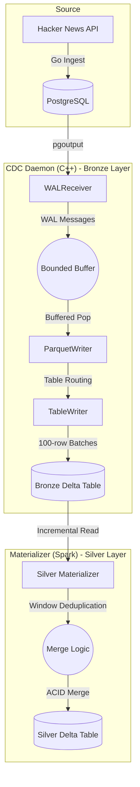
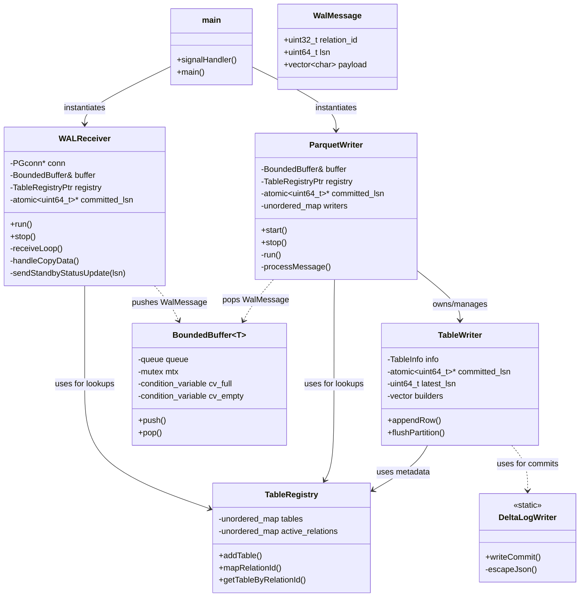
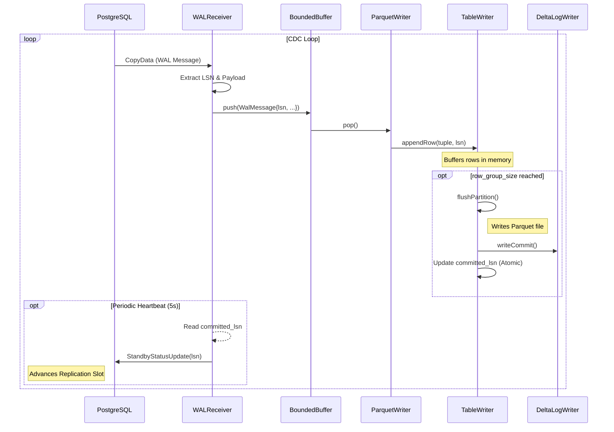
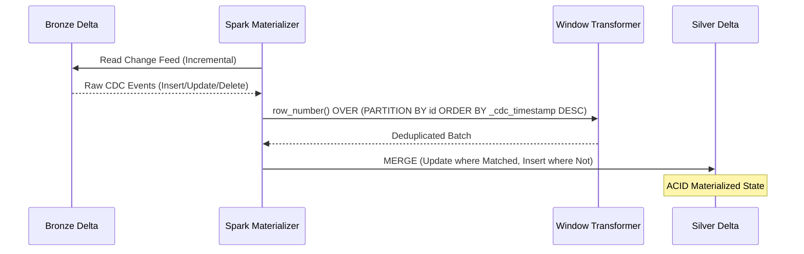

# Architecture & Design: pg_delta_lake_cdc

This document describes the high-level architecture, threading model, and the **Medallion Architecture** data flow of the PostgreSQL CDC pipeline.

## End-to-End Data Flow (Medallion Architecture)

The pipeline captures real-time changes from a source PostgreSQL database and materializes them into a refined "Silver" Delta table for analytical use.

| Layer | Type | Responsibility |
| :--- | :--- | :--- |
| **Bronze** | Raw Log | Append-only history of every change. Preserves full audit trail. |
| **Silver** | Materialized | Latest state per record. Deduplicated and ready for BI/Analytics. |

## Component Overview

The system is designed as a producer-consumer architecture using a thread-safe bounded buffer for decoupled processing.

### Class Hierarchy & Organization

## Detailed Data Flow (Sequence Diagram)

### I. WAL Capture & Bronze Writing (C++ Daemon)

This diagram illustrates the lifecycle of a WAL event from PostgreSQL to a raw Delta log.

### II. Silver Materialization (Spark Incremental Merge)

Illustrates how the downstream Spark process reconciles the raw Bronze log into a deduplicated Silver state.

## Core Responsibilities

| Component | Responsibility |
| :--- | :--- |
| **WAL Receiver** | Manages PostgreSQL connection, handles logical replication protocol, extracts LSNs, and sends feedback updates to PostgreSQL to advance the replication slot. |
| **Bounded Buffer** | Thread-safe queue providing backpressure and decoupling the network-bound receiver from the disk-bound writer. |
| **Parquet Writer** | Background worker that dispatches messages to table-specific writers and manages the `TableWriter` lifecycle. |
| **Table Writer** | Encapsulates Apache Arrow builders to construct schemas, injects CDC metadata (`_cdc_op`, `_cdc_timestamp`), and writes Parquet files. |
| **Delta Log Writer**| Static utility for generating Delta Lake protocol JSON files (commits) for ACID compliance. |
| **Table Registry** | Centralized store for mapping PostgreSQL relation OIDs to table schemas and metadata. |
| **Silver Materializer**| Python-based Spark application that performs deduplication and MERGE operations into the Silver layer. |
