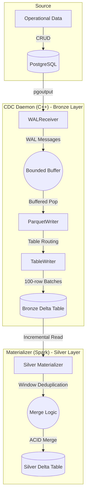
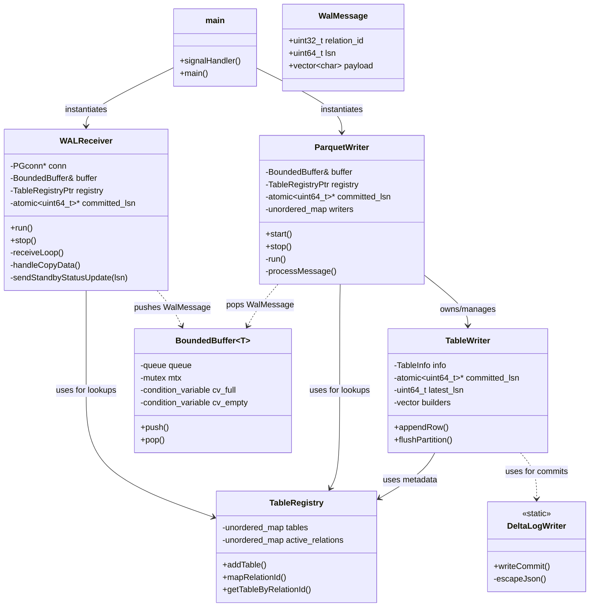
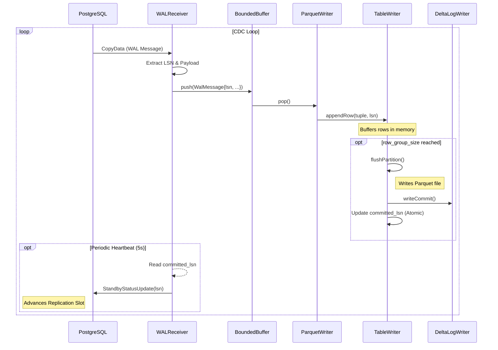
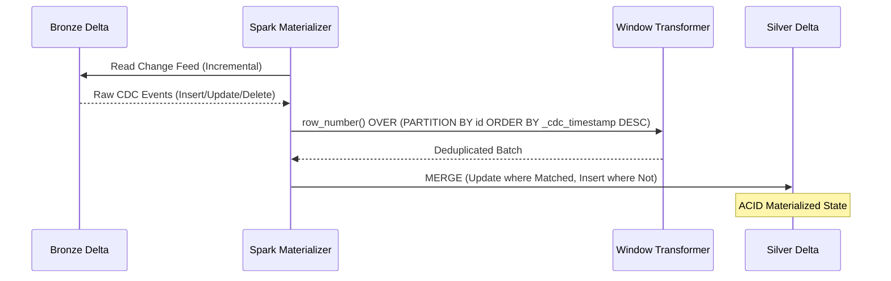

# Architecture & Design: pg_delta_lake_cdc

This document describes the high-level architecture, threading model, and the **Medallion Architecture** data flow of the PostgreSQL CDC pipeline.

> [!TIP]
> **Mermaid Support in IDE**: The diagrams below are pre-rendered for maximum compatibility. If you wish to edit them, please modify the Mermaid blocks in the source. To enable native rendering in VS Code, install the **"Markdown Preview Mermaid Support"** extension.

## End-to-End Data Flow (Medallion Architecture)

The pipeline captures real-time changes from a source operational database and materializes them into a refined "Silver" Delta table for analytical use.

View Mermaid Source

| Layer | Type | Responsibility |
| :--- | :--- | :--- |
| **Bronze** | Raw Log | Append-only history of every change. Preserves full audit trail. |
| **Silver** | Materialized | Latest state per record. Deduplicated and ready for BI/Analytics. |

## Component Overview

The system is designed as a producer-consumer architecture using a thread-safe bounded buffer for decoupled processing.

### Class Hierarchy & Organization

View Mermaid Source

## Detailed Data Flow (Sequence Diagram)

### I. WAL Capture & Bronze Writing (C++ Daemon)

This diagram illustrates the lifecycle of a WAL event from PostgreSQL to a raw Delta log.

View Mermaid Source

### II. Silver Materialization (Spark Incremental Merge)

Illustrates how the downstream Spark process reconciles the raw Bronze log into a deduplicated Silver state.

View Mermaid Source

## Component Details

### 1. WALReceiver
The `WALReceiver` is a networking component responsible for the high-performance ingestion of PostgreSQL change events.
- **Design**: Implemented using `libpq` for the PostgreSQL wire protocol. It establishes a `LOGICAL_REPLICATION` connection using the `pgoutput` plugin.
- **LSN Extraction**: Every WAL message ('w') contains a 64-bit Log Sequence Number (LSN). The receiver parses this from the binary stream (using `be64toh` for endian conversion) and associates it with the data payload.
- **Feedback Loop**: It hosts a 5-second recurring timer that reads a shared `committed_lsn` value (populated by the writers) and sends a `Status Update` back to PostgreSQL. This tells the server it can safely rotate its WAL logs.

### 2. BoundedBuffer
The `BoundedBuffer` is the primary decoupling mechanism between the producer (network) and consumer (disk) threads.
- **Design**: A template-based thread-safe circular buffer. It uses `std::mutex` and `std::condition_variable` to coordinate access.
- **Backpressure**: When the buffer reaches its maximum capacity (default 10,000 messages), the `push()` call will block. This prevents the daemon from consuming all system memory if the disk writing or S3 upload becomes a bottleneck.

### 3. TableWriter
The `TableWriter` is the "transaction" engine for each individual table.
- **Design**: It encapsulates **Apache Arrow** builders to convert PostgreSQL binary tuples into highly compressed columnar format.
- **CDC Metadata**: It automatically appends two metadata columns: `_cdc_op` (the operation type) and `_cdc_timestamp` (the processing time).
- **Atomicity**: The write operation is a two-step process: first, a Parquet file is written to the `/data` directory; second, a Delta Lake commit (JSON) is generated. Only after both succeed is the LSN marked as "committed".

### 4. ParquetWriter
The `ParquetWriter` acts as an orchestrator and multiplexer for all active tables.
- **Design**: It runs on its own background thread, continuously popping messages from the `BoundedBuffer`.
- **Dynamic Routing**: It maintains a map of `Relation ID -> TableWriter`. When a message arrives for a new table, it dynamically instantiates a new `TableWriter` by looking up the schema in the `TableRegistry`.
- **Resource Management**: It ensures that all pending data is flushed to disk before the daemon shuts down cleanly.

### 5. DeltaLogWriter
A static utility class that implements the **Delta Lake Transaction Log Protocol**.
- **Design**: It generates versioned JSON files in the `_delta_log/` directory.
- **ACID Compliance**: Each JSON file represents an atomic commit that adds the newly written Parquet file to the table metadata. This ensures that downstream Spark/DuckDB readers see a consistent, point-in-time snapshot of the data.

## LSN Acknowledgment Flow

Correct LSN handling is critical for preventing data loss and managing database storage. The system implements a **Flush-then-Confirm** strategy:

1.  **Extraction**: The `WALReceiver` captures the LSN from the replication stream and tags each message.
2.  **Buffering**: The LSN travels with the data through the `BoundedBuffer`.
3.  **Persistence**: `TableWriter` receives the rows. When a batch (e.g., 100 rows) is reached, it flushes the Parquet file to storage.
4.  **Delta Commit**: After the file is on disk, `TableWriter` generates the Delta Lake commit log.
5.  **Atomic Advancement**: Only after the Delta commit is successful, the `TableWriter` updates a shared `std::atomic<uint64_t>` variable called `committed_lsn_`.
6.  **Server Notification**: In the next 5-second interval, the `WALReceiver` reads this atomic value and sends an `r` message (Standby Status Update) to PostgreSQL.
7.  **Slot Advancement**: PostgreSQL receives the LSN and advances the `confirmed_flush_lsn` for the replication slot, allowing it to safely discard old WAL segments.
