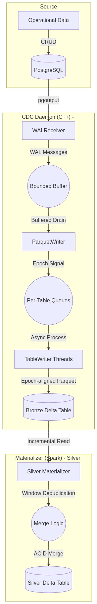
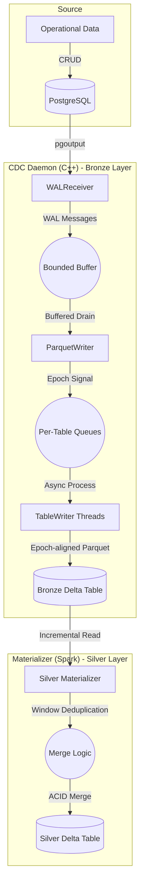
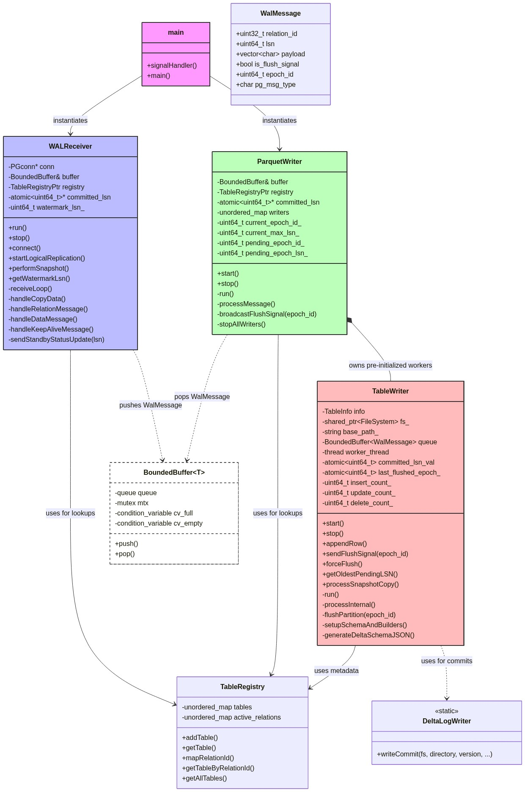
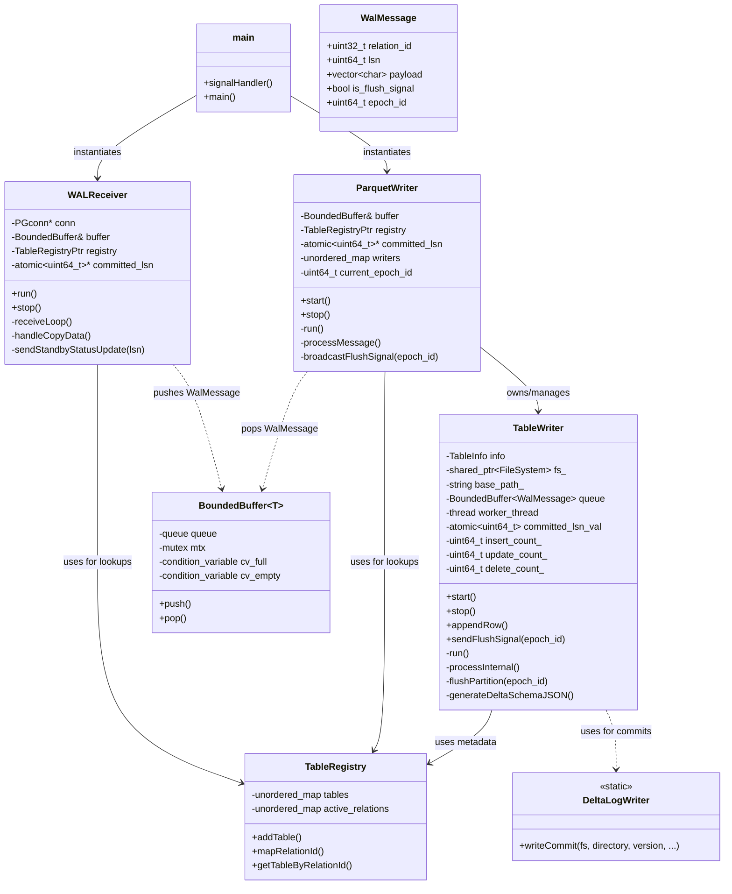
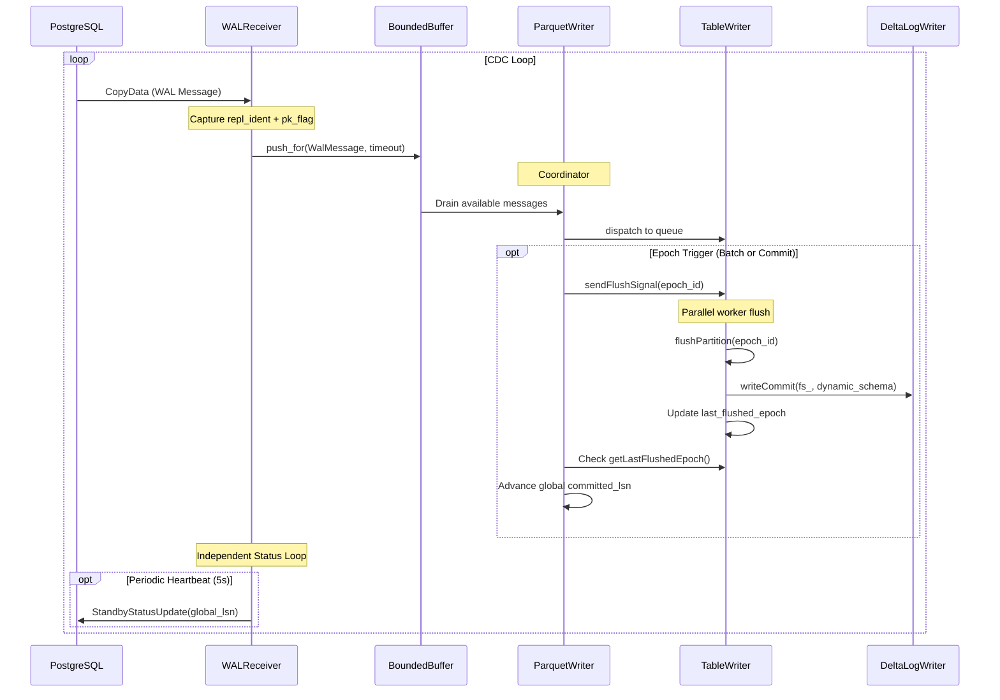
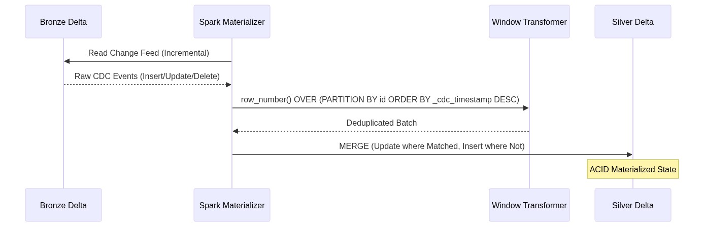
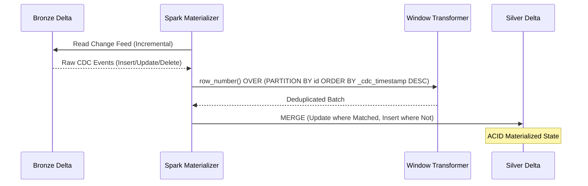
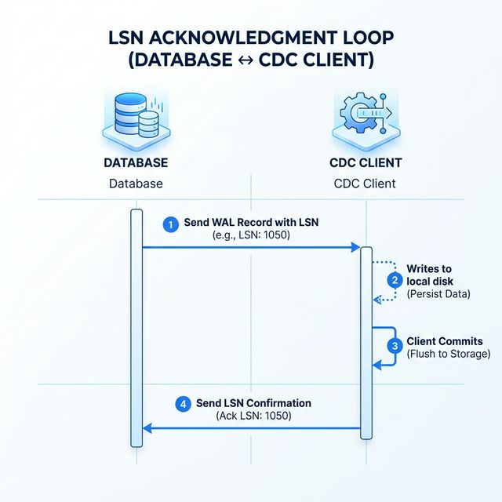

# Architecture & Design: pg_delta_lake_cdc

This document describes the high-level architecture, threading model, and the **Medallion Architecture** data flow of the PostgreSQL CDC pipeline.

> [!TIP]
> **Mermaid Support in IDE**: The diagrams below are pre-rendered for maximum compatibility. If you wish to edit them, please modify the Mermaid blocks in the source. To enable native rendering in VS Code, install the **"Markdown Preview Mermaid Support"** extension.

## End-to-End Data Flow (Medallion Architecture)

The pipeline captures real-time changes from a source operational database and materializes them into a refined "Silver" Delta table for analytical use.

View Mermaid Source

| Layer | Type | Responsibility |
| :--- | :--- | :--- |
| **Bronze** | Raw Log | Append-only history of every change. Preserves full audit trail. |
| **Silver** | Materialized | Latest state per record. Deduplicated and ready for BI/Analytics. |

## Component Overview

The system is designed as a producer-consumer architecture using a thread-safe bounded buffer for decoupled processing.

### Class Hierarchy & Organization

View Mermaid Source

## Detailed Data Flow (Sequence Diagram)

### I. WAL Capture & Bronze Writing (C++ Daemon)

This diagram illustrates the lifecycle of a WAL event from PostgreSQL to a raw Delta log.

View Mermaid Source

### II. Silver Materialization (Spark Incremental Merge)

Illustrates how the downstream Spark process reconciles the raw Bronze log into a deduplicated Silver state.

View Mermaid Source

## Component Details

### 1. WALReceiver
The `WALReceiver` is a networking component responsible for the high-performance ingestion of PostgreSQL change events.
- **Design**: Implemented using `libpq` for the PostgreSQL wire protocol. Uses a non-blocking IO loop (`PQconsumeInput` + `PQgetCopyData`).
- **Heartbeat Safety**: Implements a dedicated status update mechanism that continues to send heartbeats to PostgreSQL even if the dispatcher pipeline is temporarily blocked (backpressure), preventing slot timeout.
- **LSN Extraction**: Every WAL message ('w') contains a 64-bit Log Sequence Number (LSN). The receiver parses this and associates it with the data payload.

### 2. BoundedBuffer
The `BoundedBuffer` is the primary decoupling mechanism between the producer (network) and consumer (disk) threads.
- **Design**: A template-based thread-safe circular buffer. It uses `std::mutex` and `std::condition_variable` to coordinate access.
- **Backpressure**: When the buffer reaches its maximum capacity (default 10,000 messages), the `push()` call will block. This prevents the daemon from consuming all system memory if the disk writing or S3 upload becomes a bottleneck.

### 3. TableWriter
The `TableWriter` is now a fully asynchronous worker that manages processing for a specific table in its own thread.
- **Design**: Each `TableWriter` maintains its own `BoundedBuffer` of WAL messages. This allows a slow table (due to large schema or high write volume) to buffer independently without blocking other tables.
- **Async Execution**: It converts PostgreSQL binary tuples into Apache Arrow format via a background `run()` loop.
- **Transaction Atomicity**: Implements `BEGIN`/`COMMIT` tracking. Rows are buffered in internal Arrow builders and only flushed to Parquet upon receiving a `COMMIT` signal. Rolled-back transactions are automatically discarded by resetting builders, ensuring ACID compliance at the storage layer.
- **Schema Evolution Support**: When a schema change is detected, the `TableWriter` is gracefully restarted with the new column layout. It uses a robust **NULL-padding** strategy to handle messages that may still be using the previous metadata during the transition window.
- **Dynamic Schema**: Generates the Delta Lake JSON schema dynamically from PostgreSQL metadata on every partition flush.
- **LSN Tracking**: It tracks both the latest LSN pushed to its queue and the latest LSN successfully committed to Delta Lake.
- **Atomicity**: The write operation remains atomic: Parquet flush followed by Delta Log commit.

### 4. ParquetWriter (Coordinator & LSN Aggregator)
The `ParquetWriter` acts as the central coordinator for the parallel pipeline.
- **Global Epoch Coordination**: Implements cross-table ACID consistency by triggering global "epochs".
- **Barrier Synchronization**: Periodically broadcasts flush signals to all active `TableWriter` threads.
- **Non-blocking State Machine**: Uses a non-blocking synchronization loop that allows the engine to continue processing WAL messages while waiting for epoch confirmation, ensuring that replication heartbeats are never interrupted.
- **Min-LSN Safety Mechanism**: Ensures that the global replication slot only advances to the minimum LSN successfully committed across all parallel tables, preventing data loss on restarts.

### 5. DeltaLogWriter
A static utility class that implements the **Delta Lake Transaction Log Protocol**.
- **Design**: It generates versioned JSON files in the `_delta_log/` directory.
- **ACID Compliance**: Each JSON file represents an atomic commit that adds the newly written Parquet file to the table metadata. This ensures that downstream Spark/DuckDB readers see a consistent, point-in-time snapshot of the data.

## LSN Acknowledgment Flow

Correct LSN handling is critical for preventing data loss and managing database storage. The system implements a **Flush-then-Confirm** strategy:

1.  **Extraction**: The `WALReceiver` captures the LSN from the replication stream and tags each message.
2.  **Buffering**: The LSN travels with the data through the `BoundedBuffer`.
3.  **Persistence**: `TableWriter` receives the rows. When a batch (e.g., 100 rows) is reached, it flushes the Parquet file to storage.
4.  **Delta Commit**: After the file is on disk, `TableWriter` generates the Delta Lake commit log.
5.  **Atomic Advancement**: Only after the Delta commit is successful, the `TableWriter` updates a shared `std::atomic<uint64_t>` variable called `committed_lsn_`.
6.  **Server Notification**: In the next 5-second interval, the `WALReceiver` reads this atomic value and sends an `r` message (Standby Status Update) to PostgreSQL.
7.  **Slot Advancement**: PostgreSQL receives the LSN and advances the `confirmed_flush_lsn` for the replication slot, allowing it to safely discard old WAL segments.
