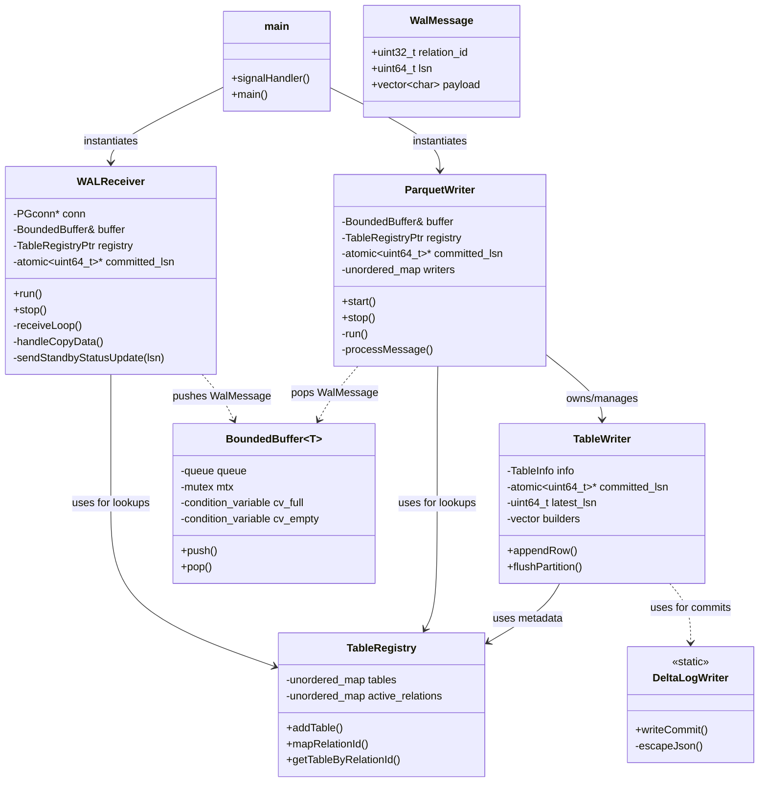
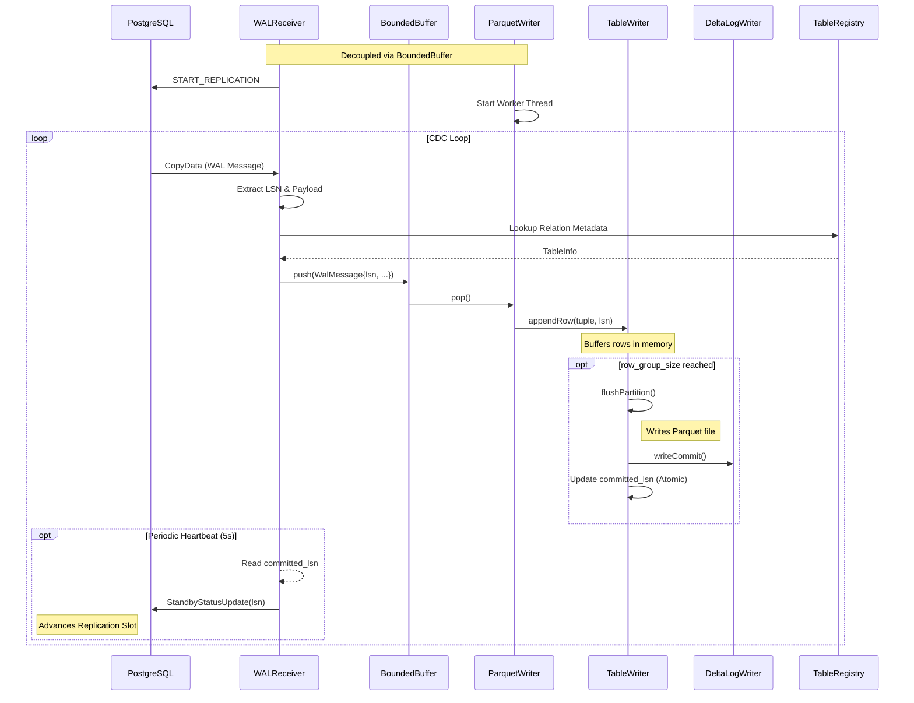

# Project Architecture: pg_delta_lake_cdc

This document provides a high-level overview of the code organization and data flow within the PostgreSQL to Delta Lake CDC (Change Data Capture) pipeline.

## Component Overview

The system is designed as a producer-consumer architecture using a thread-safe bounded buffer for decoupled processing.

### Class Hierarchy & Organization

## Data Flow (Sequence Diagram)

The following diagram illustrates the lifecycle of a WAL event from PostgreSQL to a Parquet/Delta Lake file.

## Core Responsibilities

| Component | Responsibility |
| :--- | :--- |
| **WAL Receiver** | Manages PostgreSQL connection, handles logical replication protocol, extracts LSNs, and sends feedback updates to PostgreSQL to advance the replication slot. |
| **Bounded Buffer** | Thread-safe queue providing backpressure and decoupling the network-bound receiver from the disk-bound writer. |
| **Parquet Writer** | Background worker that dispatches messages to table-specific writers and manages the `TableWriter` lifecycle. |
| **Table Writer** | Encapsulates Apache Arrow builders to construct schemas and write Parquet files. |
| **Delta Log Writer**| Static utility for generating Delta Lake protocol JSON files (commits) for ACID compliance. |
| **Table Registry** | Centralized store for mapping PostgreSQL relation OIDs to table schemas and metadata. |
