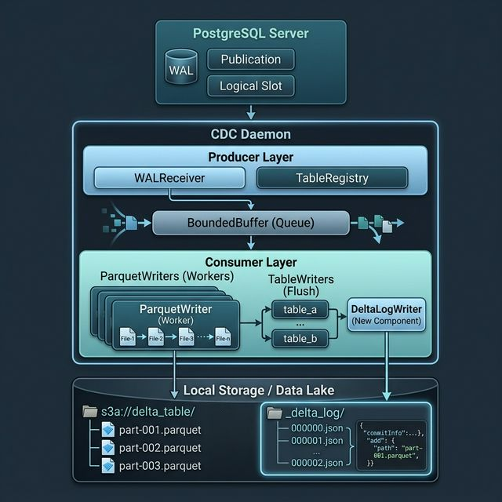
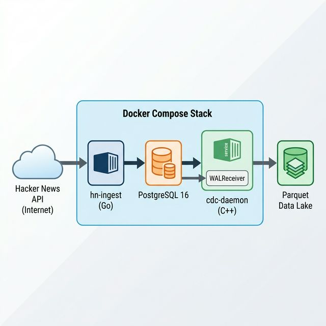
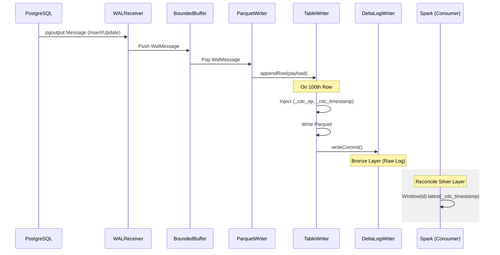

# Architecture & Design: pg_delta_lake_cdc

This document describes the high-level architecture, threading model, and the **Medallion Architecture** data flow of the PostgreSQL CDC daemon.

## High-Level Architecture

The daemon follows a **Producer-Consumer** pattern to handle high-speed data streams without blocking the PostgreSQL replication slot.

## End-to-End Test Architecture

The integrated test suite provides a full-stack environment to validate the pipeline under load.

## Core Components

### 1. WALReceiver (Producer)
The `WALReceiver` is the entry point for data ingestion.
-   **Schema Fetching**: On startup, it queries `information_schema.columns` to build an initial mapping of table structures.
-   **Replication Loop**: It uses `libpq` to establish a logical replication connection.
-   **Message Handling**: It parses `pgoutput` messages:
    -   **Relation ('R')**: Updates the `TableRegistry` with mapping from OIDs to table names.
    -   **Insert/Update ('I'/'U')**: Extracts the payload and pushes it as a `WalMessage` into the `BoundedBuffer`.

### 2. BoundedBuffer
A thread-safe circular buffer (templated) that provides:
-   **Backpressure**: If the buffer is full, the producer will wait (or drop, depending on config), preventing out-of-memory errors.
-   **Decoupling**: Allows the network thread to remain responsive even if disk I/O is slow.

### 3. ParquetWriter (Consumer)
A dedicated worker thread that:
-   Pops `WalMessage` objects from the buffer.
-   Routes messages to the appropriate `TableWriter` based on the `relation_id`.
-   Automatically manages the lifecycle of multiple `TableWriter` instances (one per table).

### 4. TableWriter
Responsible for the final conversion to columnar format:
-   **Arrow Mapping**: Maps Postgres types (int, float, text, etc.) to Apache Arrow builders.
-   **CDC Metadata Injection**: Automatically appends `_cdc_op` and `_cdc_timestamp` to every row.
-   **Delta Protocol Trigger**: Once a table hits **100 rows**, it flushes a Parquet file and triggers the `DeltaLogWriter` to commit the transaction.

### 5. DeltaLogWriter
A lightweight generator for Delta Lake transaction logs:
-   **NDJSON Generation**: Produces zero-padded transaction files (e.g., `00000000000000000000.json`).
-   **Protocol Management**: Automatically creates the `_delta_log` directory and handles `protocol`, `metaData`, and `add` actions.

## Stress Testing & Verification
A dedicated `test/` directory provides a high-speed ingestion framework:
- **hn_ingest**: A Go service that pulls live Hacker News data.
- **Stress Mode**: Fetches 500 items per interval to test daemon throughput.
- **Simplified Storage**: All AI-related overhead (embeddings/summaries) has been removed to maximize raw ingestion speed.

## Data Flow: From Postgres to Parquet

## Data Lake Layers

### 1. Bronze Layer (Raw CDC Events)
The daemon writes every database change as a new row in the Delta table.
- **Properties**: Immutable, append-only, preserves full history.
- **Metadata**: Every row includes `_cdc_op` and `_cdc_timestamp` to allow reconstruction of state.

### 2. Silver Layer (Latest State)
Downstream consumers use Window functions to extract the latest state per ID.
- **Logic**: `row_number() OVER (PARTITION BY id ORDER BY _cdc_timestamp DESC)`.
- **Optimization**: Delta Lake's Parquet indexing ensures these queries remain performant even as the Bronze log grows.

## Configuration (via .env)
The daemon is highly configurable without re-compilation:
| Variable | Description | Default |
| :--- | :--- | :--- |
| `PG_CONNINFO` | Postgres connection string | `host=localhost...` |
| `PG_SLOT_NAME` | Replication slot to listen on | `hn_cdc_stream_slot` |
| `PG_PUBLICATION_NAME` | Publication name in Postgres | `hn_cdc_stream` |
| `OUTPUT_DIR` | Target directory for Parquet files | `data` |
