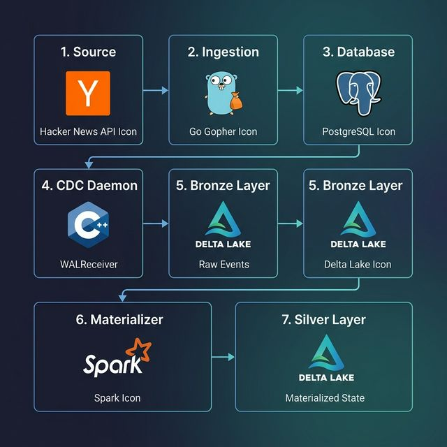
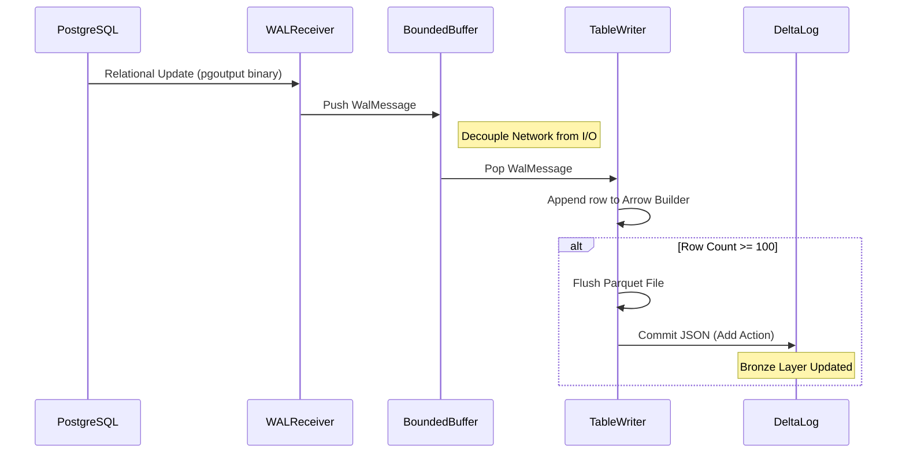
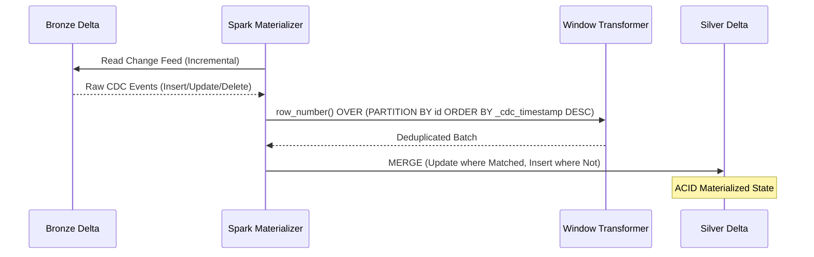

# Architecture & Design: pg_delta_lake_cdc

This document describes the high-level architecture, threading model, and the **Medallion Architecture** data flow of the PostgreSQL CDC pipeline.

## End-to-End Data Flow

The pipeline captures real-time changes from a source PostgreSQL database and materializes them into a refined "Silver" Delta table for analytical use.



## Architecture Overview (Flowchart)
graph TD
    subgraph Source
        HN[Hacker News API] -->|Go Ingest| PG[(PostgreSQL)]
    end

    subgraph "CDC Daemon (C++) - Bronze Layer"
        PG -->|pgoutput| WR[WALReceiver]
        WR -->|WAL Messages| BB((Bounded Buffer))
        BB -->|Buffered Pop| PW[ParquetWriter]
        PW -->|Table Routing| TW[TableWriter]
        TW -->|100-row Batches| BR[(Bronze Delta Table)]
    end

    subgraph "Materializer (Spark) - Silver Layer"
        BR -->|Incremental Read| SM[Silver Materializer]
        SM -->|Window Deduplication| MD((Merge Logic))
        MD -->|ACID Merge| SL[(Silver Delta Table)]
    end
```

## Core Components

### 1. WALReceiver (Producer)
The `WALReceiver` is the entry point for data ingestion.
-   **LSN Management**: Tracks the Log Sequence Number (LSN) to ensure no data loss between restarts.
-   **Replication Loop**: Uses `libpq` to establish a logical replication connection with the `pgoutput` plugin.
-   **Message Handling**: Parses binary protocol messages and pushes them as lightweight `WalMessage` objects into the thread-safe buffer.

### 2. BoundedBuffer
A thread-safe circular buffer (templated) that decouples the fast network thread from the slower disk I/O thread. It provides backpressure to prevent memory exhaustion during spikes.

### 3. TableWriter (The Delta Engine)
Responsible for the final conversion to columnar format:
-   **Apache Arrow**: Maps Postgres types to high-performance Arrow builders.
-   **CDC Metadata**: Injects `_cdc_op` (INSERT, UPDATE, DELETE) and `_cdc_timestamp` into every row.
-   **Auto-Commit**: Once a buffer hits **100 rows**, it flushes a Parquet file and immediately updates the Delta Transaction Log (`_delta_log`).

### 4. Silver Materializer (Spark)
A Python-based Structured Streaming application that simulates a cloud-native backend (e.g., Azure Fabric/Databricks).
-   **Continuous Tailing**: Monitors the Bronze table for new Parquet commits.
-   **Micro-batch Deduplication**: Uses Window functions to extract the absolute latest state for each ID within a batch.
-   **Delta Merge**: Performs an atomic `MERGE` operation to UPSERT changes into the Silver table.

## Sequence Diagrams

### I. WAL Capture & Bronze Writing
Illustrates the capture of a database event into the raw Delta log.



### II. Silver Materialization (Incremental Merge)
Illustrates how Spark reconciles the raw log into a refined state.



## Medallion Architecture Summary

| Layer | Type | Responsibility |
| :--- | :--- | :--- |
| **Bronze** | Raw Log | Append-only history of every change. Preserves full audit trail. |
| **Silver** | Materialized | Latest state per record. Deduplicated and ready for BI/Analytics. |

## Configuration
The system uses a combination of Docker environment variables and a `.env` file for high-level tuning of replication slots and output paths.
